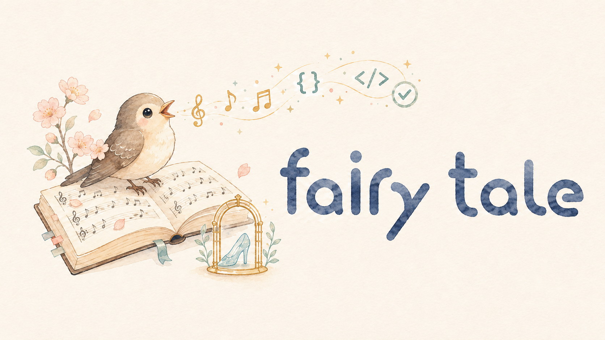

# fairy_tale

[日本語版 README](README_ja.md)



Research workspace for turning public Fable/Mythos-class agent reports into
reproducible workflow-augmentation skills and plugin packages.

Think of this project as the nightingale's scorebook.

In Andersen's tale, the court becomes enchanted by a jeweled mechanical bird,
only to learn that the living song matters more than the glittering machine.
Fairy Tale does not try to steal the bird, open the cage, or pretend to be the
emperor's locksmith. It studies public descriptions and field reports of
unusually good agent work, separates melody from myth, and writes down the
repeatable patterns as skills, checks, adapters, and sample results.

This repository does not attempt to bypass access controls, export controls, or
model safeguards. It studies public official information and public user reports
to define reusable workflow enhancements that can be run with Codex, Claude Code,
or other agent-skill-compatible coding assistants.

## Quick Start

Install the Claude Code plugin directly from GitHub:

```text
/plugin marketplace add bonginkan/fairy_tale
/plugin install fairy-tale@fairy-tale-marketplace
```

Codex's current plugin marketplace documentation supports GitHub shorthand
marketplaces such as `owner/repo`. Add the repository as a marketplace, then
install `fairy-tale` from the plugin directory:

```text
codex plugin marketplace add bonginkan/fairy_tale
```

If your Codex build does not expose the plugin CLI yet, use the plugin
directory UI and add `bonginkan/fairy_tale` as a marketplace source.

For skill-only use without a plugin, install just the canonical skills:

```bash
mkdir -p "$HOME/.codex/skills"
curl -fsSL https://raw.githubusercontent.com/bonginkan/fairy_tale/main/install.sh | sh -s -- --agent codex
```

Use `--agent claude` for `~/.claude/skills`, `--agent agents` for
`~/.agents/skills`, or `--target /absolute/skills/dir` for an explicit target.
The installer fails closed if the target directory is missing unless `--create`
is supplied.

Before publishing benchmark claims or making the repository public, read
[SECURITY.md](SECURITY.md), [CONTRIBUTING.md](CONTRIBUTING.md), and
[Feedback governance](docs/feedback-governance.md).

Before a long benchmark, multi-agent run, or context-heavy coding task, verify
that Fairy Tale is still resident in the repo skills and plugin package:

```bash
python3 scripts/fairy_tale_residency_check.py
```

Use `--check-installed --strict-installed` when you also want to require
machine-level Codex, Claude Code, and AGENTS skill installs.

For tasks where visible context may be incomplete, use the domain-neutral
[Latent Structure Harness](docs/latent-structure-harness.md) to record
observations, negative evidence, hypotheses, inferred invariants, probes, and
validators before promoting a local pattern into a general rule.

## Goals

- Describe the strongest reported Fable 5 / Mythos 5 capabilities in operational terms.
- Convert those capabilities into repeatable agent workflows.
- Package the workflow as:
  - a generic Agent Skill under `skills/fairy-tale/`
  - a Codex repo skill under `.agents/skills/fairy-tale/`
  - a Claude Code project skill under `.claude/skills/fairy-tale/`
  - a distributable Codex plugin under `plugins/fairy-tale/`
  - a distributable Claude Code plugin under `plugins/fairy-tale/`
- Track OSS pioneers and reusable ideas without importing unsafe behavior.

## Current status

The first songbook is usable:

- Fairy Tale skills are packaged for generic agents, Codex, and Claude Code.
- The plugin package supports Codex and Claude Code manifests.
- Research notes, defensive security constraints, best-practice gates, OSS watch
  notes, adapter plans, and sample comparison outputs are checked in.
- The project is prepared for public release with Apache-2.0 licensing, brand
  asset boundaries, and defensive-use constraints documented.

## Benchmark Snapshot

These are reproducible local measurements, not final leaderboard claims.
Benchmark rows must keep known Fable/Mythos data, known or measured GPT-5.5
data, and measured GPT-5.5 + Fairy Tale data separate. When a measured Fairy
Tale result is a sample estimate, report the confidence interval or half-width.
Rows marked reference-only are not official benchmark submissions.

| Domain | Benchmark | Fable/Mythos | GPT-5.5 | **GPT-5.5 + Fairy Tale** | Delta |
| --- | --- | --- | --- | --- | --- |
| Agentic coding | SWE-Bench Pro fusion-history-aware random sample, n=15 | 80.3% | 58.6% | **60.0%** | **+1.4 pp** |
| Biology | BioMysteryBench-preview, n=5 | 46.1% / 83.9% | 60.0% | **80.0%** | **+20.0 pp** |
| Cybersecurity | ExploitBench v8 ladder sample, n=6 | 78.0% Cap% | 34.0% Cap% | **1.33 avg; 4/6 positive** | **reference only** |
| Legal | Harvey LAB-compatible random sample, n=100 | 13.3% | 2.1% | **11.0%** | **+8.9 pp** |
| Context efficiency | Less-Context Bench hard seeds, n=6 x 3 runs | n/a | 10/18 correct; 6/18 budgeted | **11/18 correct; 3/18 budgeted** | **+5.6 pp correct; -16.7 pp budgeted** |
| Context completion | Less-Context Bench hard completion, n=6 x 1 run | n/a | 1/6 guarded; 4/6 recoverable; 3/6 abstain | **3/6 guarded; 4/6 recoverable; 4/6 abstain** | **+33.3 pp guarded; +16.7 pp abstain** |

Notes:

- Agentic coding Fable/Mythos and GPT-5.5 values are image-reported
  SWE-Bench Pro scores. **Fairy Tale** is a local random sample using Codex CLI
  tools, the residency hook, and the fusion-history-aware stuck retry loop,
  9/15, with 95% Wilson CI 35.7-80.2%. This is reference information, not an
  official leaderboard submission.
- Biology Fable/Mythos values are image-reported BioMysteryBench hard /
  human-solved scores. GPT-5.5 is a local medium baseline, 3/5. **Fairy Tale**
  is a local medium run, 4/5, with 95% Wilson CI 37.6-96.4%.
- Cybersecurity Fable/Mythos and GPT-5.5 values are image-reported
  ExploitBench Cap% scores. **Fairy Tale** is a local official-sandbox v8
  ladder sample, 8 total points over 6 tasks, average score 1.33, with a
  positive signal on 4/6 tasks. It is not a Cap% reproduction, so it is shown as
  reference-only rather than a direct delta.
- Legal Fable/Mythos and GPT-5.5 values are image-reported Legal Agent
  Benchmark scores. **Fairy Tale** is a local Harvey LAB-compatible random
  sample, 11/100, with 95% Wilson CI 6.25-18.63% and one-sided p vs 2.1%
  baseline = 8.90e-6.
- Less-Context Bench is a private local hard-seed calibration run, not a public
  leaderboard. The repeated smoke used the same `gpt-5.5` API model with and
  without the canonical `SKILL.md` text injected as resident process
  instructions. Correctness was 10/18 without Fairy Tale, 95% Wilson CI
  33.7-75.4%, and 11/18 with Fairy Tale, CI 38.6-79.7%. Budgeted retrieval
  worsened from 6/18, CI 16.3-56.3%, to 3/18, CI 5.8-39.2%, and mean read ratio
  increased from 1.179 to 1.214. The per-run correctness delta changed sign, so
  this does not support a stable positive effect. The result is best read as a
  measurement caveat: `SKILL.md` text injection may encourage more exhaustive
  verification and does not reproduce full skill residency, sub-file loading, or
  tool-gated workflow behavior.
- Less-Context Bench hard completion is a separate local completion-track smoke
  from sibling `less-context-bench` commit `3c48b47`. It used Codex CLI
  `gpt-5.5` with `model_reasoning_effort="xhigh"` over 6 public hard seeds,
  one recoverable and one unrecoverable completion pack per task, and no solver
  errors in either condition. Guarded completion improved from 1/6 without
  Fairy Tale, 95% Wilson CI 3.0-56.4%, to 3/6 with Fairy Tale, CI 18.8-81.2%.
  Recoverable accuracy stayed 4/6 in both conditions; the gain came from better
  abstention/citation discipline on incomplete workspaces, not from recovering
  more answerable packs. Treat this as a single-run signal, not a stable
  leaderboard claim.

### Legal Feedback Retry

The legal feedback mechanism was tested on 15 tasks selected from prior misses
in the n=100 legal sample. The retry used the same model, effort, judge, and
task IDs, adding `fairy-tale-legal-feedback` to the existing legal harness.

| Metric | Before Feedback | **After Fairy Tale Feedback** | Change |
| --- | ---: | ---: | ---: |
| All-pass rate | 0.0% | **20.0%** | **+20.0 pp** |
| Criterion pass rate | 83.21% | **90.61%** | **+7.40 pp** |
| One-miss failures | 10 | **5** | **-5** |
| Large collapses below 70% criteria | 5 | **4** | **-1** |

Strongest recovery: `corporate-ma/draft-stock-purchase-agreement` improved
from 17/117 to 102/117 criteria (+72.6 pp). Remaining weakness: several
contract/redline tasks still end at one missing criterion, so the next legal
loop should target final criterion closure rather than broad scaffolding.

Feedback retry note: **Fairy Tale** feedback used the same model, effort,
judge, and task IDs as the before-feedback slice. After-feedback all-pass was
3/15 with 95% Wilson CI 7.05-45.19%; criterion score was 1004/1108.

### SWE-Bench Pro Failure Review

The latest SWE-Bench Pro sample solved 9/15 tasks. The 6 misses were mostly
contract-preservation failures rather than complete task non-starts:

| Failure class | Count | Observed pattern |
| --- | ---: | --- |
| API compatibility break | 2 | Changed public or internal call signatures without updating all existing callers or tests. |
| Missing adjacent file / symbol | 2 | Added a partial implementation while leaving required helper files or type definitions absent. |
| Behavior edge-case miss | 1 | Main implementation compiled, but a migration or mapping invariant still differed from expected data. |
| Test-mock contract break | 1 | Refactor changed construction shape and broke an existing test double expectation. |

Concrete examples: one Ansible patch changed `recursive_finder` so existing
tests hit missing positional arguments; one Element Web patch made
`Recorder` non-constructable under the existing mock; one Vuls patch referenced
undefined `ServerTypePseudo` / `Distro`; one Teleport AI patch referenced new
token-count symbols without adding the definitions; one Teleport migration patch
lost the expected trusted-cluster role mapping; one ProtonMail composer patch
referenced a missing `PasswordInnerModalForm` module.

BioMysteryBench-preview was run through `scripts/biomystery_runner.py`.
The Fairy Tale run uses generic evidence gates for expression signatures,
context-only BLAST evidence, and bacterial marker-sequence identity. The current
remaining miss is the Brachypodium stress-type item (`hb053`), where the model
still selects a non-heat stress label without stronger heat-specific evidence.

### Feedback Loop Effects

These measurements track whether evaluated feedback loops improve the harness.
They are not final leaderboard claims.

| Benchmark | Initial **Fairy Tale** | Feedback **Fairy Tale** | Tool / Gate **Fairy Tale** | Effect |
| --- | ---: | ---: | ---: | ---: |
| SWE-Bench Pro | 60.0% +/-32.6 pp (n=5) | 40.0% +/-32.6 pp (n=5) | 60.0% +/-22.2 pp (n=15) | +0.0 pp / +20.0 pp |
| HLE random sample, n=100 | 35.0% +/-9.4 pp | 37.0% +/-9.5 pp | 51.0% +/-9.8 pp | +16.0 pp |
| ExploitBench v8 sample | 0.67 | 3.00 | 1.33 | +0.66 vs initial |

Notes:

- SWE-Bench Pro: feedback-only regressed on the small sample. The latest
  history-aware fusion run reached 9/15 with 95% Wilson CI 35.7-80.2%
  (half-width 22.2 pp), so treat the 60.0% point estimate as reference
  information until a larger held-out sample narrows the interval. The latest
  feedback ledger keeps the observed success practices `local_invariant_mapping`,
  `targeted_container_validation`, and `named_interface_completion`, while the
  failure review now prioritizes API compatibility, adjacent-symbol closure,
  migration invariants, and test-double contract checks.
- HLE: feedback-only improved from 35/100 to 37/100. The Codex-tools +
  residency-harness run reached 51/100, but it changes the tool condition and
  remains within the uncertainty band of the image-reported GPT-5.5 with-tools
  value.
- ExploitBench: the initial sample scored 4 total points over 6 tasks. The
  feedback-only slice scored 6 total points over 2 tasks, and the expanded
  fusion/feedback sample scored 8 total points over 6 tasks, with 4/6 positive
  signals. Because the score is a ladder value and one expanded-sample task
  still ended at `no_tool_calls`, treat this as a directional improvement rather
  than a stable Cap% result.

## Important boundaries

- Security workflows are defensive-only.
- No exploit weaponization, persistence, stealth, credential theft, or bypass guidance.
- Use budgets and validation gates before launching parallel agents.
- Treat user reports as anecdotal unless independently reproduced.
- Preserve provenance for all research claims.
- See [SECURITY.md](SECURITY.md) for vulnerability reporting and defensive-use
  boundaries.

## Primary docs

- [Research summary](docs/research-summary.md)
- [Benchmark validation plan](docs/benchmark-validation-plan.md)
- [Domain gap analysis](docs/domain-gap-analysis.md)
- [Cybersecurity strengthening](docs/cybersecurity-strengthening.md)
- [ARC-AGI-3 lab analysis](docs/arc-agi-3-lab-analysis.md)
- [Best practices](docs/best-practices.md)
- [OpenMythos external adapter](docs/openmythos-external-adapter.md)
- [Similarity refactoring adapter](docs/similarity-refactoring-adapter.md)
- [Legal feedback analysis](docs/legal-feedback-analysis.md)
- [Feedback governance](docs/feedback-governance.md)
- [Fairy Tale residency harness](docs/fairy-tale-residency-harness.md)
- [OSS watch](docs/oss-watch.md)
- [Core Fairy Tale skill](skills/fairy-tale/SKILL.md)
- [Benchmark feedback skill](skills/fairy-tale-benchmark-feedback/SKILL.md)
- [Legal feedback skill](skills/fairy-tale-legal-feedback/SKILL.md)
- [Fairy Fusion adapter](adapters/fairy-fusion.adapter.json)
- [Feedback pruning adapter](adapters/feedback-pruning.adapter.json)
- [Fairy adapter runner](crates/fairy-adapter-runner/)
- [BioMystery runner](scripts/biomystery_runner.py)
- [SWE-Bench Pro preparer](scripts/swebench_pro_prepare.py)
- [SWE-Bench Pro runner](scripts/swebench_pro_run.py)
- [ExploitBench runner](scripts/exploitbench_run.py)
- [Benchmark feedback ledger](scripts/benchmark_feedback_ledger.py)
- [Legal feedback analyzer](scripts/legal_feedback_analyzer.py)
- [Feedback pruner](scripts/feedback_pruner.py)
- [Residency check](scripts/fairy_tale_residency_check.py)
- [Skill-only installer](install.sh)
- [Skill package builder](scripts/package_skills.py)
- [Fairy Fusion reviewer](scripts/fairy_fusion_review.py)
- [SWE-Bench Pro adapter](adapters/swe-bench-pro.adapter.json)
- [ExploitBench adapter](adapters/exploitbench.adapter.json)
- [Contributing guide](CONTRIBUTING.md)
- [Security policy](SECURITY.md)
- [Release notes](RELEASE_NOTES.md)

## Claude Code plugin

This repo includes a Claude Code marketplace catalog at
`.claude-plugin/marketplace.json`. In Claude Code, add the GitHub marketplace
and install the plugin:

```text
/plugin marketplace add bonginkan/fairy_tale
/plugin install fairy-tale@fairy-tale-marketplace
```

The plugin ships a `SessionStart` residency hook at
`plugins/fairy-tale/hooks/hooks.json` that runs
`fairy_tale_residency_check.py --inject` at every session start, so the Fairy
Tale workflow stays resident without a per-session reminder. The hook fails
open: a degraded skill install warns on stderr but never blocks the session.

When this repository changes, pull the new plugin version into an existing
install and reload so the updated hook and skills take effect:

```text
/plugin marketplace update fairy-tale-marketplace
/plugin update fairy-tale@fairy-tale-marketplace
/reload-plugins
```

For local development, `git clone` this repository and use
`/plugin marketplace add .`.

The same `plugins/fairy-tale/` package also remains a Codex plugin via
`plugins/fairy-tale/.codex-plugin/plugin.json` and the repo marketplace at
`.agents/plugins/marketplace.json`.

## License

Original source code, skills, adapters, schemas, scripts, and documentation in
this repository are licensed under the Apache License, Version 2.0
(`Apache-2.0`), unless a file or directory states otherwise. See [LICENSE](LICENSE)
and [NOTICE](NOTICE).

The Fairy Tale name, logo, and other brand assets are not licensed under
Apache-2.0. They may be used only to refer accurately to this project, without
implying endorsement, sponsorship, official status, or affiliation.

Third-party repositories, benchmark materials, reports, datasets, and assets
referenced by this repository remain under their own licenses and terms.

## Referenced GitHub repositories

These repositories informed the current skill, adapter, and plugin architecture.
The maintained list is in [Referenced GitHub repositories](docs/referenced-repositories.md).
